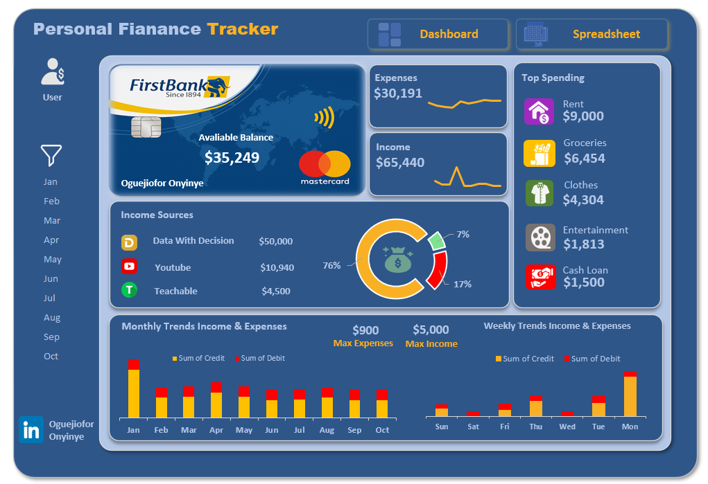

# Personal Finance Tracker Dashboard

### Project Overview
This interactive Excel dashboard helps track personal income, expenses, and spending habits across months and weeks. 
The project was inspired by a tutorial from Freedom Oboh and shared through Evergreen Digital Tech Solution on YouTube.

### Dataset Info
Manually entered personal finance data including income streams, categorized expenses, and transaction dates across various months and weeks.

### Tools Used
- Microsoft Excel – Data entry, cleaning, and visualization

- PivotTables & PivotCharts – For summarizing financial patterns

- Custom Visual Design – Icons, layout, and color coordination for an engaging user interface

### Data Cleaning
- Validated and categorized income and expense data

- Structured dates for proper weekly/monthly grouping

- Removed duplicates and standardized labels

### Analysis Objectives
- Track income and expenses over time

- Identify top spending categories

- Monitor weekly and monthly trends

- Visualize income source contributions

### Results
- Income: $65,440 | Expenses: $30,191 | Balance: $35,249

- Top Income Source: Data With Decision ($50,000)

- Top Spending: Rent ($9,000), Groceries, Clothes

- Monday shows the highest weekly spending

- Highest monthly income recorded in March

### Visualizations Used
- Doughnut Chart – Income Source Breakdown

- Line Chart – Income and Expense Trends

- Stacked Column Chart – Monthly and Weekly Summaries

- Card Visuals – Balance, Income, Expenses, Top Spending

### Limitations
- Data is manually entered and fictional for learning purposes

- Lacks real-time data updates or multi-year analysis

- Not connected to any live financial platforms

### Recommendations
- Automate with Excel Forms or connect to APIs for real-time tracking

- Extend to include savings goals and debt payoff plans

- Build an advanced version using Power BI or Google Data Studio

### Conclusion
This project was a fun and insightful journey into financial data visualization using Excel.
Thanks to Freedom Oboh for the inspiration and to Evergreen Digital Tech Solution for the educational support!

